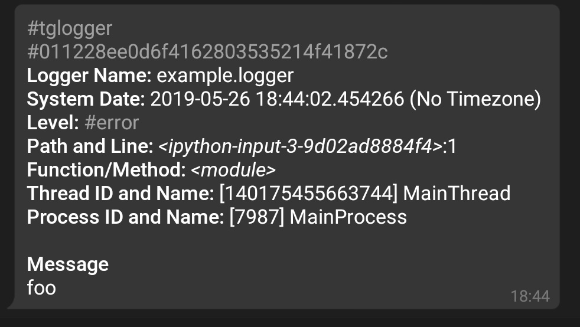
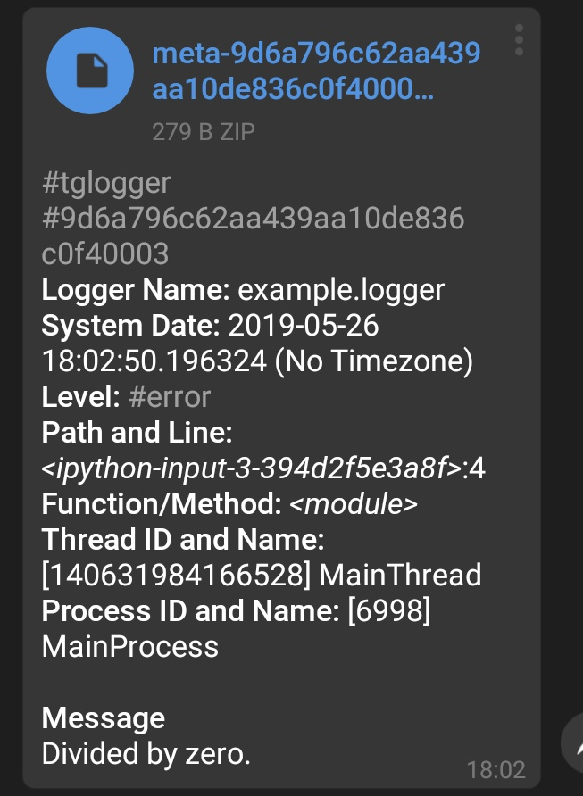

# Logging

## Handler

`Handler` is a special base class defining what will happen when a
`LogRecord` is captured. You can initialize and add multiple handlers to
a logger. There are many built-in `Handler`s such as `ConsoleHandler`,
which prints `LogRecord`s to the console or `FileHandler`, which appends
log records to a file.

### How to Add Handler

`TelegramHandler` is a handler that takes `LogRecord` and sends it to a
chat. You can initialize it as below:

```python
from tglogger.handler import TelegramHandler
import logging

handler = TelegramHandler(
    level=logging.ERROR,  # default value
    bot_token="foo",
    receiver="bar"
)

# then add handler to logger
logger.addHandler(handler)
```

!!! tip
    You can also set `TELEGRAM_BOT_TOKEN` and `TELEGRAM_RECEIVER`
    environment variables instead of manually adding `bot_token` and
    `receiver` to `TelegramHandler` initialization.

## Formatter

`Formatter` is a special base class generating a log message from a
`LogRecord`.

### How to Set Formatter

`TelegramFormatter` is a formatter that takes `LogRecord`
and generates a message specific to Telegram.

```python
from tglogger.formatter import TelegramFormatter

formatter = TelegramFormatter()

# set formatter on handler
handler.setFormatter(formatter)
```

### The Message Format

The message format is as below:

```
#tglogger
#{uuid_hex}
*Logger Name:* {logger_name}
*System Date:* {system_date} ({zone})
*Level:* #{level_name}
*Path and Line:* _{path}_:{lineno}
*Function/Method:* _{func_name}_
*Thread ID and Name:* [{thread_id}] {thread_name}
*Process ID and Name:* [{process_id}] {process_name}

*Message*
{message}
```

 - **Banner Hashtag** (#tglogger): Each message has `#tglogger` banner hashtag
 so that you can filter only log messages in a chat.
 - **uuid_hex:** It is a unique ID of a `LogRecord`. This is especially
 useful when you want to filter a `LogRecord`'s general info and stack
 trace message.
 - **logger_name:** The name of the logger where the `LogRecord` is
 received from.
 - **system_date:** The date of the system. It uses
 `django.utils.timezone` if `DJANGO_SETTINGS_MODULE` environment variable
 is set, or uses standard library if it is not set.
 - **zone:** If `DJANGO_SETTINGS_MODULE` is set and `USE_TZ` is `True`,
 the `TIME_ZONE` is shown, else it just shows "No Timezone".
 - **level_name:** It is a hashtag so that you can filter based on log
 level of `LogRecord`.
 - **path:** The Python file absolute path where the `LogRecord` is
 captured.
 - **line:** The line where the `LogRecord` is captured.
 - **func_name:** The function or method where the `LogRecord` is
 captured.
 - **thread_id:** The ID of the thread.
 - **thread_name:** The name of the thread.
 - **process_id:** The ID of the process.
 - **process_name:** The name of the process.

## General Setup

General Setup consists of the steps below:

1. Grab a `logging.Logger` instance.
2. Create a `tglogger.handler.TelegramHandler` instance.
3. Create a `tglogger.handler.TelegramFormatter` instance.
4. Set formatter of the `TelegramHandler` instance.
5. Add handler to the `Logger` instance.

An implementation for general purpose is as below:

```python
import logging
from tglogger.handler import TelegramHandler
from tglogger.formatter import TelegramFormatter

logger = logging.getLogger(__name__)  # (1)
# you already have TELEGRAM_BOT_TOKEN and TELEGRAM_RECEIVER environment variables
handler = TelegramHandler()  # (2)
formatter = TelegramFormatter()  # (3)
handler.setFormatter(formatter)  # (4)
logger.addHandler(handler)  # (5)
```

## Sending Logs

### Regular Logs

Any level above `ERROR` will be sent to chat.

```python
logger.error("foo")
logger.info("bar")  # no message will be sent
```



You can change this behavior by setting level of your
handler on initialization or later on.

```python
# after creation
handler.setLevel(logging.INFO)  # info and above

# or when you create
handler = TelegramHandler(level=logging.INFO)
```

!!! warning
    You might want to check [bot request throttling on Telegram](limitations.md#telegram-bot-request-throttle).

### Log Messages with Meta Info

In some occasions, `tglogger` sends a zip file attached to the message. This
zip file is generated when an exception is captured or `DJANGO_SETTINGS_MODULE`
is set.

This generated zip file, for now, only contains stack trace about exception.
However, it is planned to contain information about Django settings and
requet information as well.

Normally, logger captures the exception under an `except` block as below:

```python
try:
    1 / 0  # cannot divide to 0, will fail
except ZeroDivisionError:
    logger.exception("Divided by zero.")  # or any message you'd like
    # as you can see, we do not pass either instance or class of ZeroDivisionError
    # logger obtains it itself
```

Then we receive meta zip as attached to a log message.




!!! note
    Capturing exception behavior is wrapped in Django. If your Django
    application raises Exception on runtime, you will receive stacktrace.
